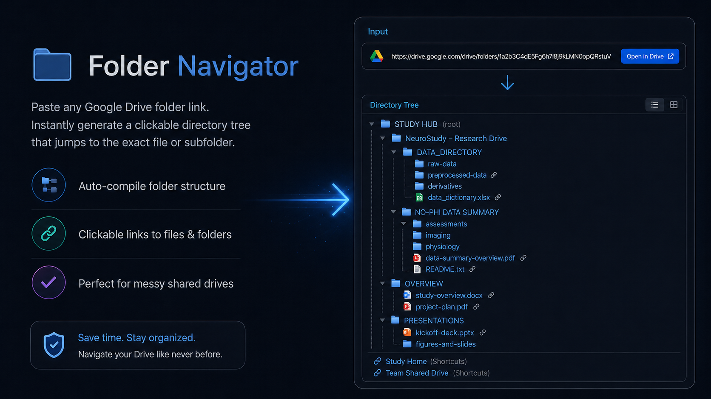

# Folder Navigator

Google Colab notebook for turning a Google Drive folder link into a clickable directory tree.

  

  

  <strong>Navigate shared Google Drive folders without opening every nested folder by hand.</strong> 
  Paste a folder URL, authenticate with Google Drive, and generate a clickable file-and-folder map.

  <code>Google Drive folder link</code> <code>-&gt;</code> <code>clickable directory tree</code>

> [!TIP]
> If GitHub shows an `Invalid Notebook` preview, open the notebook in Colab instead. The notebook uses Google Colab authentication and Drive API calls that are meant to run in Colab.

[Open the Folder Navigator notebook in Google Colab](https://colab.research.google.com/drive/1jkLfctMj5L7nNZMs4Mus-XCJdsBDViYD)

Use this when you have a Google Drive folder or shared drive directory and want to:

- see the full nested folder structure in one place;
- open files and subfolders directly from clickable links;
- inspect messy shared drives before cleaning or reorganizing them;
- follow folder shortcuts while avoiding repeated loops;
- create a quick directory map for data-resource review or handoff.

## Files

| Path | Purpose |
| --- | --- |
| [`folder-navigator.ipynb`](https://colab.research.google.com/drive/1jkLfctMj5L7nNZMs4Mus-XCJdsBDViYD) | Main Colab notebook. |
| `teaser.png` | README teaser image. |

## Output

The notebook displays a clickable HTML directory tree in Colab.

| Item | What appears in the tree |
| --- | --- |
| Folders | Folder names linked to their Google Drive locations, with nested contents shown below. |
| Files | File names linked to their Google Drive preview pages. |
| Shortcuts | Shortcut entries labeled as shortcuts; folder shortcuts can be expanded. |
| Empty folders | An `empty` marker. |
| Access errors | A visible error message for folders the authenticated account cannot open. |

## Quick Start

1. Open [`folder-navigator.ipynb`](https://colab.research.google.com/drive/1jkLfctMj5L7nNZMs4Mus-XCJdsBDViYD) in Google Colab.
2. Run **Connect to Google Drive** and authenticate with the Google account that has access to the target folder.
3. Paste a Google Drive folder URL or folder ID into **Folder directory**.
4. Run **Describe folder**.
5. Use the generated directory tree to open files, folders, and shortcuts directly.

## Step-by-Step Guide

### 1. Connect to Google Drive

Run **Connect to Google Drive** first. This installs the required Google API package, authenticates your Google account, and creates the Drive API client used by the rest of the notebook.

### 2. Add a Folder Link

Run **Folder directory** and replace `FOLDER_URL` with the Google Drive folder you want to inspect.

The notebook accepts:

- a full Google Drive folder URL;
- a raw Drive folder ID;
- common Google Drive, Docs, Sheets, Slides, Forms, and file URLs that contain a Drive ID.

### 3. Generate the Directory Tree

Run **Describe folder**. The notebook reads the root folder metadata, lists its children, and recursively builds an HTML tree.

Each visible item links back to Google Drive so you can jump straight to the exact file or subfolder.

## Notes

- The tree only includes files and folders visible to the Google account you authenticate in Colab.
- Shared drives are supported through the Drive API settings used by the notebook.
- Shortcut loops are skipped after a folder has already been visited.
- Large folder trees may take longer to render because the notebook recursively asks Drive for each nested folder.
