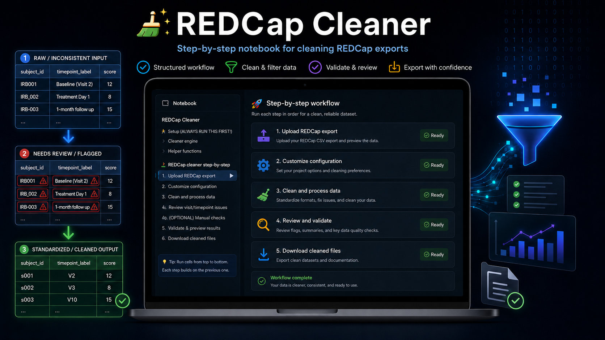
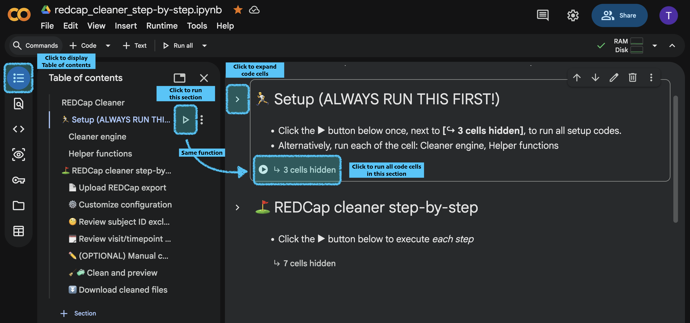
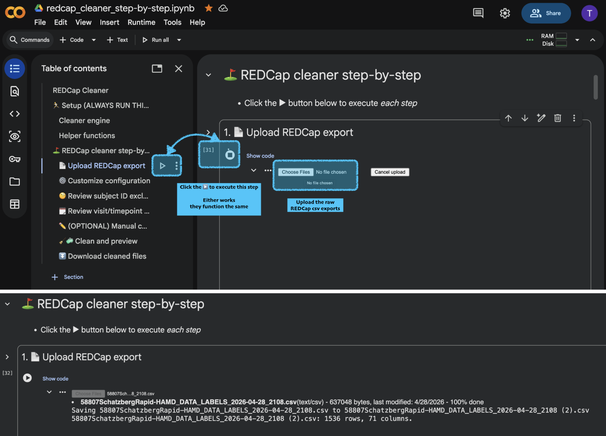
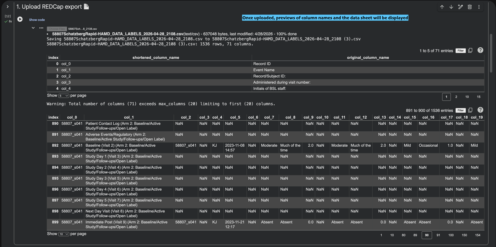
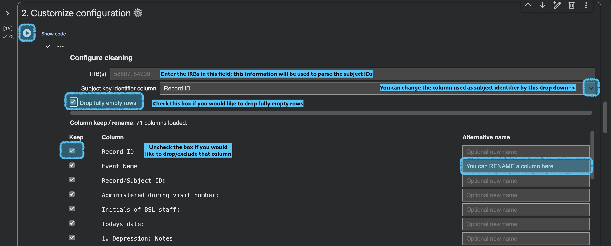
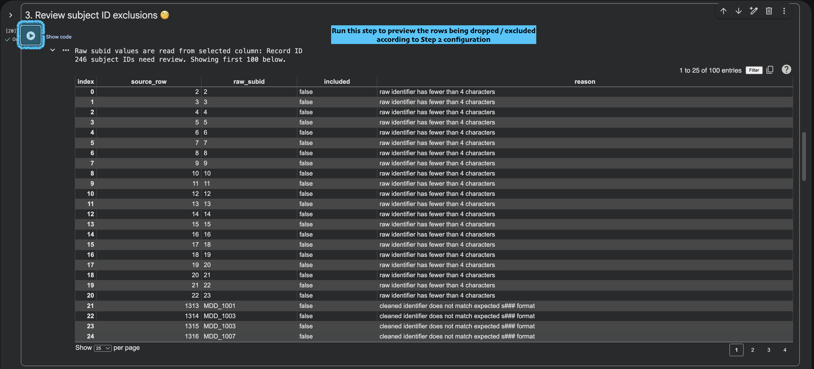
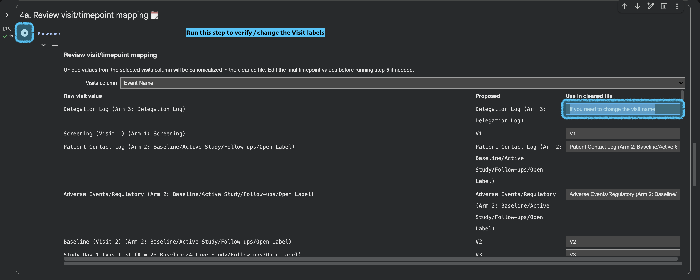
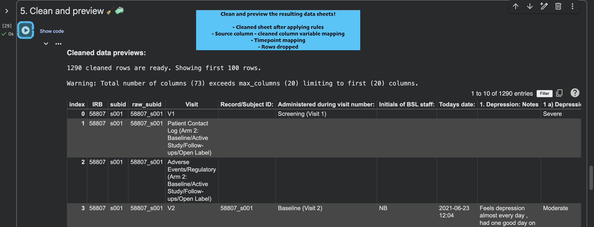
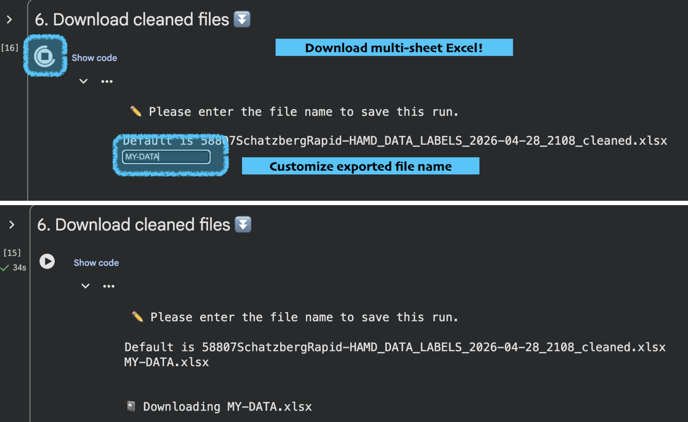

# REDCap Cleaner

Step-by-step Google Colab notebook for turning REDCap exports into cleaner, analysis-ready Excel workbooks.

  

  

  <strong>Clean REDCap exports without hand-editing spreadsheets.</strong> 
  Upload an export, review IDs, rename columns, normalize visits, and download one traceable workbook.

  <code>_raw</code> <code>➜</code> <code>_raw</code> + <code>_cleaned</code> + <code>timepoint_dictionary</code> + <code>column_variable_dictionary</code> + <code>excluded_rows</code>

> [!TIP]
> If GitHub shows an `Invalid Notebook` preview, open the notebook in Colab instead. GitHub's notebook renderer can fail on Colab widget metadata, but the linked notebook is meant to run in Colab.

[Open the REDCap Cleaner notebook in Google Colab](https://colab.research.google.com/drive/1zZG9gbXq1o3bruxNNkm54csMEjJiuBsc?usp=sharing)

Use this when you have a REDCap `.csv`, `.xls`, or `.xlsx` export and want to:

- standardize subject IDs into `s###` style IDs;
- keep, drop, and rename columns through an editable mapping table;
- review subject rows that look like outliers before excluding them;
- canonicalize visit/timepoint labels such as `Baseline (Visit 2)` to `V2`;
- download one multi-sheet Excel workbook with raw data, cleaned data, dictionaries, and excluded rows.

## Files

| Path | Purpose |
| --- | --- |
| [`REDCap_cleaner_step_by_step.ipynb`](https://colab.research.google.com/drive/1zZG9gbXq1o3bruxNNkm54csMEjJiuBsc?usp=sharing) | Main Colab notebook. |
| `tutorial/` | Local-only screenshot guide. Screenshots are intentionally not pushed because they may show REDCap-derived study content. |

## Output Workbook

The notebook downloads one `.xlsx` file with these sheets:

| Sheet | Contents |
| --- | --- |
| `_raw` | Original uploaded REDCap data, preserved as uploaded. |
| `_cleaned` | Cleaned data after subject ID, column, and timepoint rules are applied. |
| `timepoint_dictionary` | Raw visit/timepoint values and their canonical cleaned names. |
| `column_variable_dictionary` | Source column to cleaned column mapping, including dropped columns. |
| `excluded_rows` | Subject rows excluded during subject ID review. |

## Quick Start

1. Open [`REDCap_cleaner_step_by_step.ipynb`](https://colab.research.google.com/drive/1zZG9gbXq1o3bruxNNkm54csMEjJiuBsc?usp=sharing) in Google Colab.
2. Run the setup cells first.
3. Upload a REDCap export.
4. Configure IRB values, subject ID column, and column keep/rename choices.
5. Review subject ID exclusions.
6. Review visit/timepoint mappings.
7. Clean and preview.
8. Download the final multi-sheet workbook.

## Step-by-Step Guide

### 1. Run Setup

Run the setup section before using the workflow cells. This loads the cleaner engine and helper functions.

  

### 2. Upload a REDCap Export

Run **1. Upload REDCap export**, choose your REDCap export file, and wait for Colab to confirm the filename, row count, and column count.

  

After upload, the notebook displays a column-name preview and a data preview. Wide REDCap exports may show shortened preview column names while preserving the original column names for cleaning and export.

  

### 3. Customize Configuration

Run **2. Customize configuration**.

Set:

- `IRB(s)`: comma-separated IRB/study numbers to strip from subject IDs, such as `58807, 54909`;
- `Subject key identifier column`: the column that contains subject IDs;
- `Drop fully empty rows`: optional cleanup for blank REDCap rows;
- `Column keep / rename`: choose which columns to keep and type shorter cleaned names where helpful.

  

### 4. Review Subject ID Exclusions

Run **3. Review subject ID exclusions**.

The notebook shows subject identifiers that do not cleanly map to the expected subject ID format. These rows are excluded unless you manually include specific raw IDs in the optional correction step.

  

### 5. Review Visit and Timepoint Mapping

Run **4a. Review visit/timepoint mapping**.

The notebook finds unique values in the selected visit/timepoint column, proposes canonical names, and lets you edit the cleaned value before running the final cleaning step.

  

Examples:

| Raw value | Cleaned value |
| --- | --- |
| `Screening (Visit 1)` | `V1` |
| `Baseline (Visit 2)` | `V2` |
| `Study Day 1 (Visit 3)` | `V3` |

### 6. Clean and Preview

Run **5. Clean and preview**.

This applies the subject ID rules, column keep/rename rules, optional outlier inclusions, and timepoint mapping. The notebook previews:

- cleaned data;
- timepoint dictionary;
- column variable mapping;
- excluded rows.

  

### 7. Download the Workbook

Run **6. Download cleaned files**.

You can accept the default filename or type a custom filename. If you do not include `.xlsx`, the notebook appends it.

  

## Notes

- Long REDCap labels are easiest to manage by renaming columns in step 2 while preserving the original source names in `column_variable_dictionary`.
- Timepoint mapping changes the selected visit/timepoint column values in `_cleaned`; it does not rename the uploaded file.
- Keep `_raw` and the dictionary sheets with the cleaned sheet so downstream users can trace every cleaned column back to the original REDCap export.
