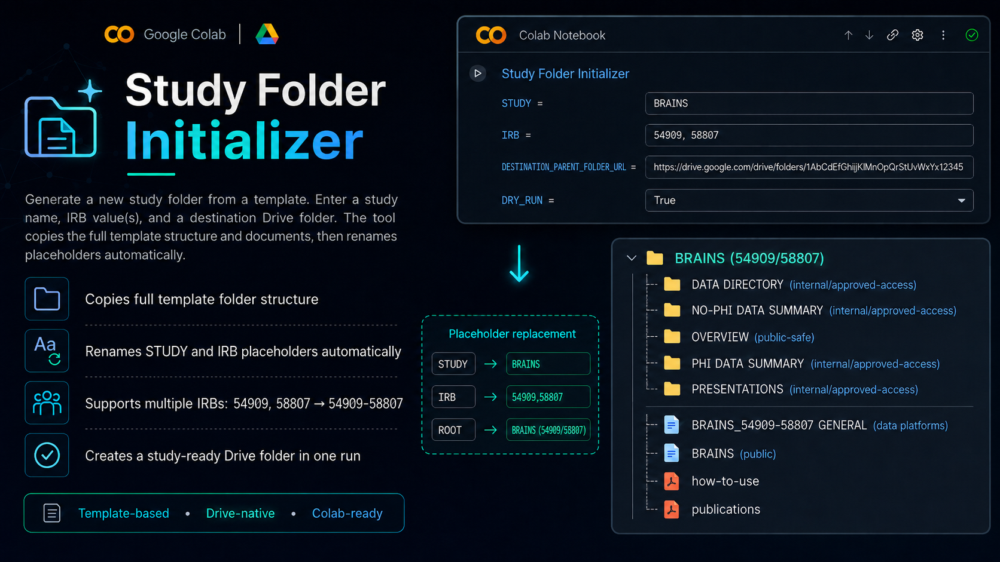

# Study Folder Initializer

Google Colab notebook for creating a new study Google Drive folder from a reusable template.

  

  

  <strong>Start a study folder without manually copying and renaming every template file.</strong> 
  Enter a study name, IRB value(s), and destination Drive folder, then generate a study-ready folder structure.

  <code>study name</code> + <code>IRB</code> + <code>template</code> -&gt; <code>study folder</code>

> [!TIP]
> If GitHub shows an `Invalid Notebook` preview, open the notebook in Colab instead. The notebook uses Google Colab authentication and Google Drive API calls that are meant to run in Colab.

[Open the Study Folder Initializer notebook in Google Colab](https://colab.research.google.com/drive/1jkLfctMj5L7nNZMs4Mus-XCJdsBDViYD?usp=sharing)

Use this when you are setting up a new study data-resource folder and want to:

- copy a full template folder structure into a destination Google Drive folder;
- rename study placeholders such as `STUDY` to the new study name;
- replace IRB placeholders with one or more IRB numbers;
- create consistent public, internal, PHI, no-PHI, presentation, and platform-facing folders;
- preview the planned changes with a dry run before writing to Drive.

## Files

| Path | Purpose |
| --- | --- |
| [Study Folder Initializer notebook](https://colab.research.google.com/drive/1jkLfctMj5L7nNZMs4Mus-XCJdsBDViYD?usp=sharing) | Main Colab notebook. |
| `teaser.png` | README teaser image. |

## Inputs

| Input | Purpose |
| --- | --- |
| `STUDY` | Short study name used when renaming folders, documents, and placeholders. |
| `IRB` | One or more IRB numbers. Multiple values are combined into a study folder label such as `54909-58807`. |
| `DESTINATION_PARENT_FOLDER_URL` | Google Drive folder URL where the new study folder should be created. |
| `DRY_RUN` | Preview mode. Use this first to confirm what the notebook will create before writing files. |

## Output

The notebook creates a study-specific Google Drive folder copied from the template.

| Output item | What it contains |
| --- | --- |
| Root study folder | Study name and IRB-aware folder label, such as `BRAINS (54909/58807)`. |
| Data folders | Internal folders for approved-access, PHI, no-PHI, and related data summaries. |
| Public-facing folders | Public-safe overview, publication, and platform-facing materials. |
| Renamed documents | Template documents with study and IRB placeholders replaced. |

## Quick Start

1. Open the [Study Folder Initializer notebook](https://colab.research.google.com/drive/1jkLfctMj5L7nNZMs4Mus-XCJdsBDViYD?usp=sharing) in Google Colab.
2. Run the setup and Google Drive authentication cells.
3. Set `STUDY` to the short study name.
4. Set `IRB` to the study IRB number(s), separated by commas if needed.
5. Paste the destination parent Google Drive folder URL into `DESTINATION_PARENT_FOLDER_URL`.
6. Run once with `DRY_RUN = True` and review the planned folder and placeholder changes.
7. Set `DRY_RUN = False` and rerun when the preview looks correct.

## Step-by-Step Guide

### 1. Connect to Google Drive

Run the authentication/setup section first. Use the Google account that owns or has edit access to the destination parent folder and the template folder.

### 2. Configure the Study

Set the study name and IRB values. For studies with multiple IRBs, enter them as comma-separated values, such as `54909, 58807`.

The notebook uses these values to replace placeholders in folder names, document names, and copied template content where supported.

### 3. Choose the Destination Folder

Paste the Google Drive folder URL where the initialized study folder should be created.

The notebook accepts a normal Google Drive folder URL or the folder ID embedded in that URL.

### 4. Preview With Dry Run

Run with `DRY_RUN = True` first. Dry-run mode lets you inspect the planned folder creation and placeholder substitutions before anything is written.

### 5. Create the Study Folder

After reviewing the preview, switch `DRY_RUN` to `False` and rerun the creation step.

The notebook copies the template structure, creates the study-specific root folder, and applies placeholder replacements for the configured study and IRB values.

## Notes

- Always run dry-run mode before creating the final Drive folder.
- The notebook can only copy folders and files visible to the Google account authenticated in Colab.
- Confirm the destination parent folder before running with `DRY_RUN = False`; the output is written directly to Google Drive.
- Use consistent study abbreviations and IRB formatting so downstream data-resource folders stay predictable.
